由于摄像头是rtsp格式的，h5原生不支持这种格式，网上查了很多教程大多是使用rtsp转rtmp，不过rtmp需要falsh的支持，但是在chrome已经默认禁用、包括未来也会逐渐淘汰，所有最终这种方案被淘汰。

于是我想应该把rtsp转化成一种类似http协议的方式，能够直接被h5识别，于是我google，百度就不用说了，查了半天全是没用的东西。终于我找到了一种叫jsmpeg的插件，它主要是通过webSocket发送MPEG，前端通过js解析MPEG不断绘制canvas，包括音频。最终测试的结果就是一个1920*1080分辨率的画面延时大概的0.5s左右，超出我的预料，性能居然这么高。后台观察发现浏览器使用了GPU加速。

准备工具：
- 1、Ffmpeg：用来解码的，做视频逃不掉这个
- 2、Node.js：搭建webSocket服务器，以及运行一个jsmpeg的js文件
- 3、jsmpeg：运行主程序

可以到[我的github](https://github.com/lavenderGirl/demo-projects/tree/master/videoStream)去下载

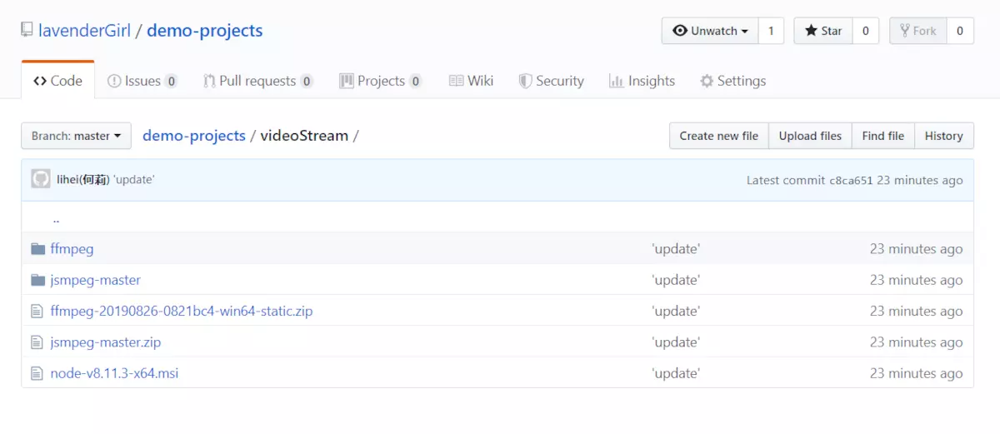


其实整个步骤就以下几步：
1. 解压ffmpeg,然后配置一下环境变量
2. 安装node,如电脑已安装node,这一步忽略
3. 安装webSocket模块[具体操作：cd到jsmpeg所在路径,执行`npm install ws`即可]
4. 在jsmpeg所在路径下，执行 `node websocket-relay.js supersecret 8081 8082`
5. 打开另一个cmd：`ffmpeg -i "你的rtspurl" -q 0 -f mpegts -codec:v mpeg1video -s 1366x768 http://127.0.0.1:8081/supersecret`
6. 打开jsmpeg文件夹里面的view-stream.html页面就可以看到你的监控视频了

如果在view-stream.html中能看到摄像头视频的话，那也就可以在自己的html中这样去实现：
```html
<!-- html -->
<canvas id="video-canvas"></canvas>
```

```js
// js
var canvas = document.getElementById('video-canvas');
var url = 'ws://127.0.0.1:8082/';
var player = new JSMpeg.Player(url, {canvas: canvas});
```
效果如下：

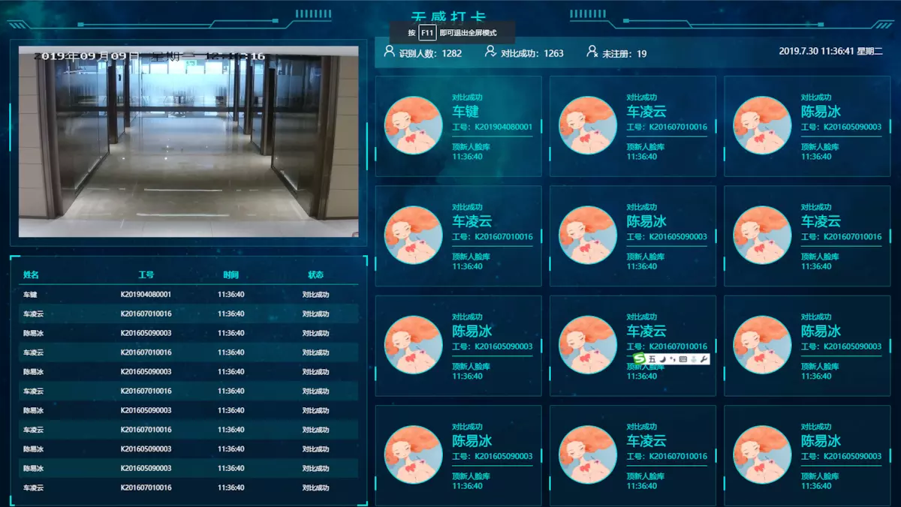

下面是比较详细的操作过程：


解压之后的ffmpeg是这样


接下来需要配置一下环境变量，把ffmpeg下的bin配置到系统path变量里面，根据自己不同的路径配置

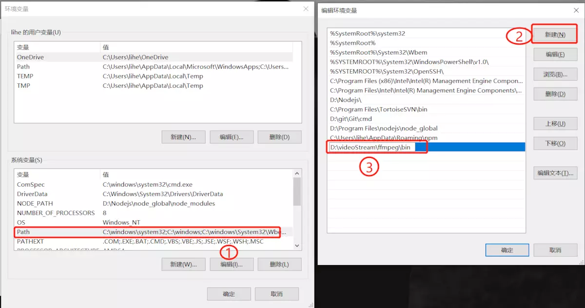

在cmd里输入ffmpeg回车  输出以下代表配置正确

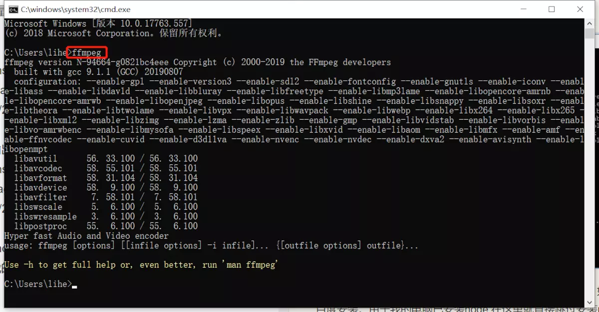


此时如果电脑上已经安装了node，那就直接可运行jsmpeg，如果没有安装node,请先百度安装。由于我的电脑已安装node,在这里就直接跳过安装node这一步。

解压jsmpeg压缩文件到某个盘符，里面出现有一个websocket-relay.js，我们主要运行这个js文件

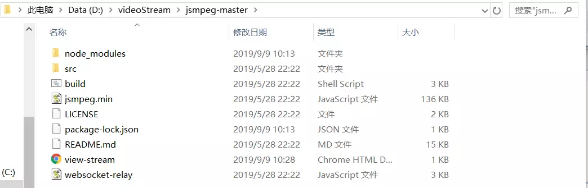

运行websocket-relay.js之前node需要安装webSocket模块
- 打开cmd控制台，cd到jsmpeg所在路径
- npm install ws
- node websocket-relay.js supersecret 8081 8082

说明：

- Supersecret是密码
- 8081是ffmpeg推送端口
- 8082是前端webSocket端口
然后在cmd中执行：`ffmpeg -i "你的rtspurl" -q 0 -f mpegts -codec:v mpeg1video -s 1366x768 http://127.0.0.1:8081/supersecret`

出现下面这样说明正确
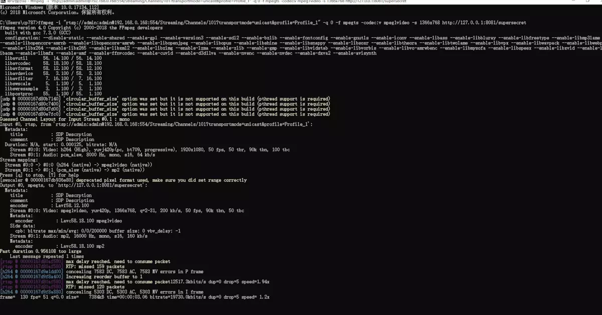

打开jsmpeg文件夹里面的view-stream.html页面如果没有问题应该出现下面的画面，到此为止在h5播放rtsp方案算基本完成

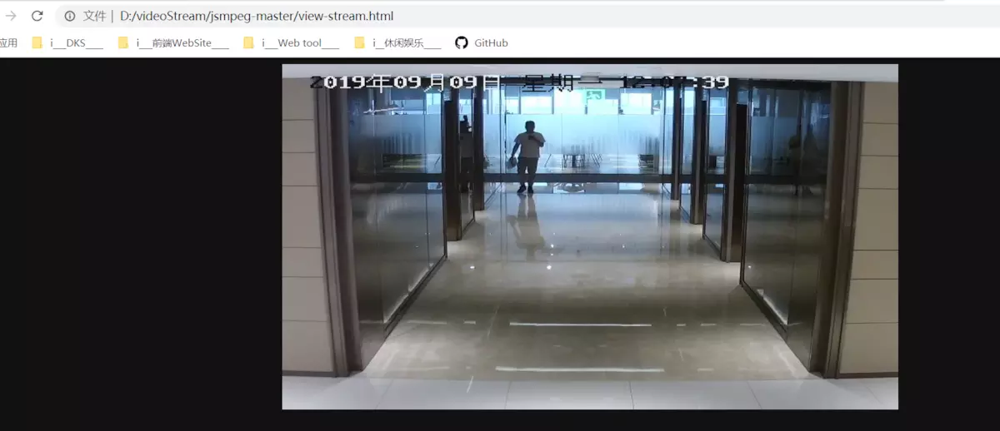


我这边的node版本是v10.15.3

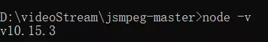

##### 安装过程中遇到的小问题

我的是window10操作系统8G 64位
在全局安装ws后，执行`node websocket-relay.js supersecret 8081 8082`会报`cannot find module 'ws'`,不知道是不是node版本太高的原因

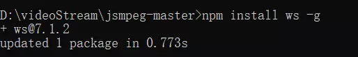

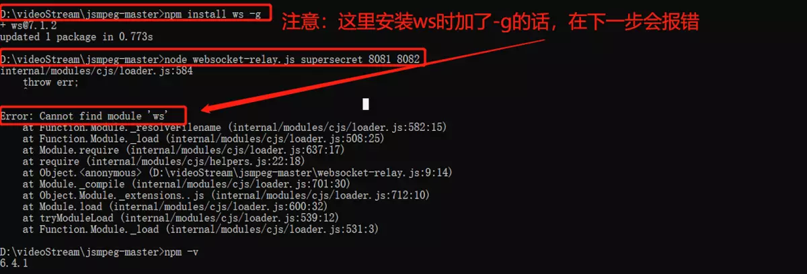

所以在安装的时候不要加-g，按照下面的步骤来。

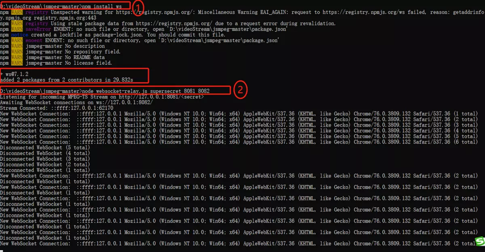

如果电脑设置了睡眠之后再打开，会发现视频监控停止了，此时不要紧张，在cmd里重新执行一下
1. 在D:\videoStream\jsmpeg-master路径下执行`node websocket-relay.js supersecret 8081 8082`
2. 打开另一个cmd执行：`ffmpeg -i "你的rtspurl" -q 0 -f mpegts -codec:v mpeg1video -s 1366x768 http://127.0.0.1:8081/supersecret` 

##### 参考资料

[html5播放rtsp方案](https://my.oschina.net/chengpengvb/blog/1832469?tdsourcetag=s_pctim_aiomsg)


